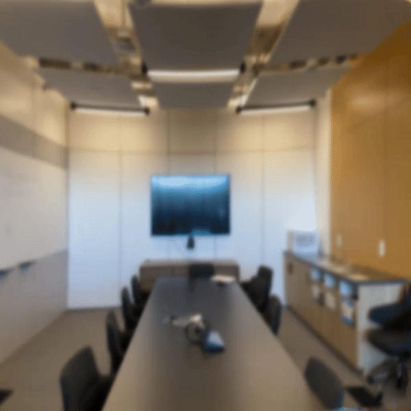

#  Improved 3D Gaussian Splatting

## Dictionary of God that is ideas (at the moment lame):
* ** Strategy-1 : ** Perform NAFNet deblurring, and then SPSR superresolution of images before COLMAP routine + GS routine
* ** Strategy-2 : ** Peform Real-ESRGAN deblurring and then SPSR superresolution of images before COLMAP routine + GS routine
* ** Strategy-3 : ** Poisson blending of Strategy-1 and Strategy-2 outputs (before COLMAP routine + GS routine)
## Installation

**Platform**: Ubuntu 22+

### Setting up Real-ESRGAN
```bash
cd Real-ESRGAN
pip install basicsr
pip install -r requirements.txt
python setup.py develop

wget https://github.com/xinntao/Real-ESRGAN/releases/download/v0.2.5.0/realesr-general-x4v3.pth
```
#### Basic Inference
For inference, the basic commands are:
```bash
python inference_realesrgan.py -n realesr-general-x4v3 -i <folder of images>
rm -rf esrgan_output
mv results esrgan_output
```

### Setting up NAFNet
```bash
cd NAFNet
gdown https://drive.google.com/file/d/14D4V4raNYIOhETfcuuLI3bGLB-OYIv6X/view?usp=sharing --fuzzy
mv NAFNet-REDS-width64.pth experiments/pretrained_models
pip install -r requirements.txt
python setup.py develop --no_cuda_ext
```
#### Basic Inference
```bash
python deblur.py --dir <folder of images>
```


## Running Commands
```bash
chmod +x run_strategy_1.sh
./run_strategy_1 <path to images folder>
```


```bash
chmod +x run_strategy_2.sh
./run_strategy_2 <path to images folder>
```


```bash
chmod +x run_strategy_3.sh
./run_strategy_3 <path to images folder>
```

### Rendering and Metrics
I use [Nerfstudio](https://docs.nerf.studio/quickstart/installation.html) (which uses [Splatfacto](https://docs.nerf.studio/nerfology/methods/splat.html)) and [Hloc](https://github.com/cvg/Hierarchical-Localization) for rendering the gaussian splats, and use original GS repo code for evaluating metrics. For rendering and evaluation, run:

```bash
cd rendering_and_metrics
python gs_schedule.py --dir <folder containing images to render (which can be blurr)> --gt_dir <ground truths for those images, especially if they are blurr>
```
The results are stored in "args.dir"+"_gs" folder as renderings and metrics (.txt) file.
## Some Results

### Comparison with Blurry and Ground Truth
| Ground Truth | Blurry | NAFNet->SPSR (Strategy-1) |
|:---:|:---:|:---:|
|  |  |  |
| SSIM :    0.8418334<br>PSNR :   34.5210227<br>LPIPS:    0.0444530 | SSIM :    0.7365065<br>PSNR :   31.6519640<br>LPIPS:    0.2315612 | SSIM :    0.7202776<br>PSNR :   31.8796042<br>LPIPS:    0.1643362 |


### Action of Debluring Models on Rendering

<figure>
    
    <figcaption><b>Ground Truth Gaussian Splatting</b><br>SSIM: 0.8537942<br>PSNR: 34.8942894<br>LPIPS: 0.0486813</figcaption>
</figure>


|                 | Motion-Blurred                                      | Lens-Blurred                                        | Gaussian-Blurred                                    |
|-----------------|-----------------------------------------------------|-----------------------------------------------------|-----------------------------------------------------|
| **NAFNet**      | <br>**SSIM**: 0.7144054<br>**PSNR**: 31.8041596<br>**LPIPS**: 0.2725016 | <br>**SSIM**: 0.8256776<br>**PSNR**: 33.8201837<br>**LPIPS**: 0.0865366 | <br>**SSIM**: 0.7774865<br>**PSNR**: 32.7108423<br>**LPIPS**: 0.1944816 |
| **Real-ESRGAN** | <br>**SSIM**: 0.7185786<br>**PSNR**: 31.4306795<br>**LPIPS**: 0.3563879 | <br>**SSIM**: 0.7592866<br>**PSNR**: 32.5180515<br>**LPIPS**: 0.1568963 | <br>**SSIM**: 0.6342124<br>**PSNR**: 28.8450565<br>**LPIPS**: 0.5116010 |
| **Bad-Gaussians** | <br>**SSIM**: 0.7338864<br>**PSNR**: 31.7400618<br>**LPIPS**: 0.3800035 | <br>**SSIM**: 0.7877066<br>**PSNR**: 33.4288919<br>**LPIPS**: 0.1447114 | <br>**SSIM**: 0.7671796<br>**PSNR**: 32.7544921<br>**LPIPS**: 0.2529144 |


### Comparison with Other Deblurring Rendering Techniques

| Original Gaussian Splatting | Preprocessed-Gaussian Splatting (Strategy-1) | Preprocessed-Gaussian Splatting (Strategy-3) |
|:--:|:--:|:--:|
|  |  |  |

| BAD-Gaussians | Deblur-NeRF |
|:--:|:--:|
|  |  |


